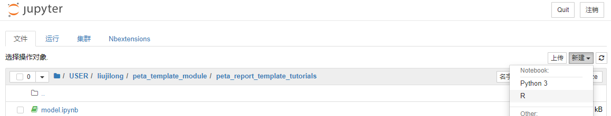
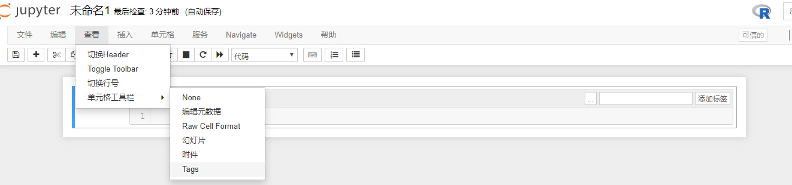
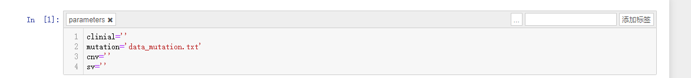
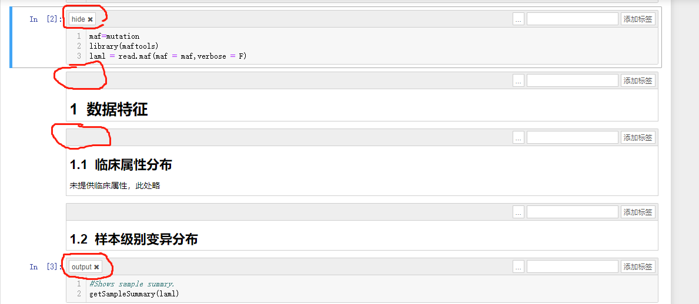

PETA报告模板制作教程

# 简介

PETA数据库使用jupyter notebook做为报告模板的惟一格式，同时提供ir和ipython kernel支持。

# 数据接口及测试数据

## 文件接口

PETA系统提供4个参数接口至报告模板，分别为样本属性（tsv）、变异记录（maf）、cnv（tsv）和sv（tsv）记录文件的路径。

```python
clinial=''
mutation='data_mutation.txt'
cnv=''
sv=''
```

测试数据见`data_mutation.txt`

## 代码接口

暂未开放

# 模板制作示例

以下以R语言的ir kernel为例。

1. 启动本地jupyter服务，以R kernel新建笔记本

   

2. 调出标签模式。

   菜单栏->单元格工具栏-->Tags

   

3. 将PETA接口变量写入第一个cell，并添加“parameters”标签

   为变量设定default可以使用测试数据对代码进行测试。

   

4. 正常编辑内嵌Markdown和计算及绘图cell，并为cell添加tag。

   cell tag意义：

   | tag    | 报告中cell表现      |
   | ------ | ------------------- |
   | 无tag  | 显示In和Out         |
   | hide   | 不显示              |
   | output | 只显示Out，不显示In |

   

   


完成后的模板在在jupyter交互式环境下运行测试通过即可提交。


模板示例见`model.html`

转换脚本见`pipe.sh`

运行结果见`output.html`

